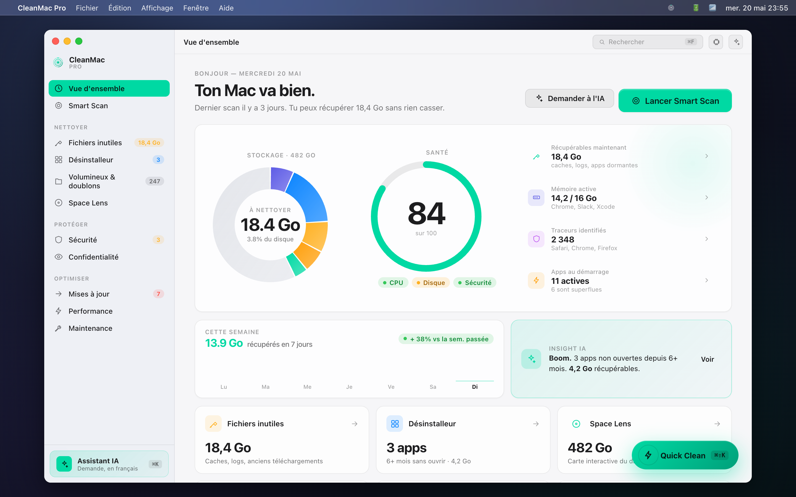

# CleanMac Pro

> A lean, fast, transparent disk cleaner for macOS — native Swift + SwiftUI.

[](https://swift.org)
[](#)
[](LICENSE)
[](#)

<p align="center">
  
</p>

## Why?

Mac cleaners are usually one of three things: bloated Electron apps, pushy
freemium upsell engines, or opaque tools that delete things you can't see.
**CleanMac Pro is none of those.**

- **Native** — Swift + SwiftUI, ~4 MB binary, runs cold in under a second.
- **Transparent** — every byte is shown with its full path before anything moves.
- **Safe** — cleaning calls `FileManager.trashItem`, never `rm`. Restore is one click.
- **Local** — zero network calls outside the optional iTunes Search lookup for App Store updates.
- **No marketing modals.** Ever.

## Features

| Module          | What it does                                                              |
|-----------------|---------------------------------------------------------------------------|
| **Dashboard**   | Health ring · storage sunburst · weekly trend · 9 module shortcuts        |
| **Smart Scan**  | Runs cleanup + files + security + updates + privacy in parallel           |
| **Cleanup**     | Caches, logs, trash, temp dirs (`~/Library/Caches`, `~/Library/Logs`, …)  |
| **Uninstaller** | Apps + residues across `~/Library/Application Support`, Caches, Containers|
| **Files**       | Large files (≥ 50 MB) + old files (> 180 d) + SHA-256-verified duplicates |
| **Space Lens**  | Squarified treemap of the home directory with drill-down                  |
| **Security**    | FileVault, Gatekeeper, SIP, Firewall, XProtect, known-malware paths       |
| **Privacy**     | Per-browser cookies / cache / history — Safari, Chrome, Firefox, Brave, Arc|
| **Updates**     | App Store via iTunes Search API · Homebrew formulae + casks · macOS softwareupdate|
| **Performance** | Login items, LaunchAgents, top RAM consumers — disable from the row        |
| **Maintenance** | 6 real macOS maintenance commands with native admin prompts                |
| **Result**      | Mega-number recap, breakdown, confetti                                     |

Plus: floating **Quick Clean** FAB (⌘⇧K), **menu bar widget** with live
CPU/RAM/Disk meters, **onboarding** with explicit "what we touch / what we
don't" transparency screen.

## Architecture

```
Sources/
├── CleanCore/                # Library — pure, no UI deps
│   ├── Models.swift          # ScanItem, ScanResult, ModuleID, Severity
│   ├── Scanner.swift         # FileScanner protocol + Cleaner
│   ├── FileSystem.swift      # FS enumeration + ByteFormatter
│   ├── Shell.swift           # Run system CLIs with timeout
│   └── Scanners/
│       ├── CleanupScanner.swift       # caches/logs/trash
│       ├── LargeFilesScanner.swift
│       ├── DuplicatesScanner.swift    # size group + SHA-256
│       ├── AppUninstaller.swift
│       ├── SpaceLensScanner.swift     # du-based home survey
│       ├── SecurityScanner.swift      # fdesetup, spctl, csrutil, socketfilterfw, XProtect
│       ├── PrivacyScanner.swift       # per-browser data
│       ├── UpdatesScanner.swift       # iTunes Search API + brew + softwareupdate
│       ├── PerformanceScanner.swift   # osascript login items, LaunchAgents, ps
│       └── MaintenanceScanner.swift   # 6 real maintenance commands
│
├── CleanMacPro/              # Executable — SwiftUI app
│   ├── App.swift
│   ├── AppState.swift
│   ├── DashboardView.swift   # RootView, MainPane
│   ├── Theme/Tokens.swift    # 4 accents, dark mode, wallpapers
│   ├── Components/           # GlassPanel, Ring, Sunburst, ModuleCard, MiniStat,
│   │                         # WeeklyTrend, CategoryRow, SortMenu, ScreenHeader, …
│   ├── Shell/                # Sidebar, Toolbar, QuickCleanFAB, MenubarWidget, Onboarding
│   └── Screens/              # Dashboard, SmartScan, ScanScreen (generic), SpaceLens, Result
│
└── CleanMacProSmoke/         # Standalone runner — exercises scanners with no XCTest
```

A single `FileScanner` protocol drives every module:

```swift
public protocol FileScanner: Sendable {
    var module: ModuleID { get }
    func scan(progress: @escaping (Double, String) -> Void) async throws -> ScanResult
}
```

The UI treats every scanner the same way: empty → scanning → results, with sort/select/clean.

## Build

Requires Swift 5.9+ (Xcode 15 or macOS Command Line Tools).

```bash
swift build -c release
./Tools/build-app.sh                 # assembles CleanMac Pro.app + ad-hoc signs
cp -R "build/CleanMac Pro.app" /Applications/
```

Or open the package in Xcode:

```bash
open Package.swift
```

## Verify

```bash
swift run CleanMacProSmoke   # 8 checks against fixture trees
```

XCTest tests live in `Tests/CleanCoreTests/` — they run when you have a full
Xcode install (Command Line Tools alone can't import `XCTest`).

## Permissions

Some modules need extra macOS permissions to be fully useful:

| Module       | Permission                              | Effect if missing                       |
|--------------|------------------------------------------|------------------------------------------|
| Cleanup      | (none)                                  | Skips unreadable system caches silently  |
| Files / Space Lens | **Files and Folders** or Full Disk Access | Some folders show as empty       |
| Privacy      | Full Disk Access                        | Safari history/cookies invisible         |
| Performance  | Automation (System Events)              | Login items list is empty                |
| Maintenance  | Native admin prompt at run time          | sudo tasks fail otherwise                |

## Roadmap

- [ ] Notarized signed distribution
- [ ] Sparkle feed checks for direct-download apps
- [ ] Optional Claude API integration for the AI assistant overlay
- [ ] Schedule scans via LaunchAgent
- [ ] Locales: EN / ES / DE / DE

## Credits

- UI design ported from the prototype generated with [Claude Design](https://claude.ai/design).
- Built with [Claude Code](https://claude.com/claude-code) — most code in this
  repo was authored by Claude, reviewed and merged by a human.

## License

MIT — see [LICENSE](LICENSE).
